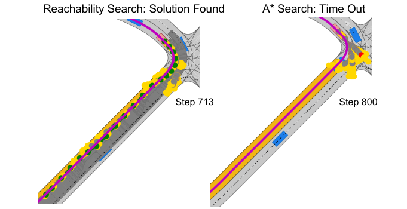

# Commonroad_reachability_search
This repo archive a safety guaranteed search-based motion planner combined with reachability analysis. 
### Usage
The reachability_search rely on several packages of commonroad which is developed by TUM cyber physical system group: commonroad-curvilinear-coordinate-system, commonroad-drivability-checker, commonroad-reachability, commonroad-search.
If you are a TUM student in Cyber Physical System team and have access to commonroad platform, you can test this motion planner as follows:

1. Install the dependencies required by the packages mentioned above.
2. Replace the student.py in Commonroad-search with reachability_search.py; helpers.py and visualization_gw.py are minimum needed utils for commonroad-reachability package
3. Run the simulation by selecting reachablity_search in batch_processing_config.yaml

### Result
The reachability_search motion planner improves searching speed in urban scenarios with narrow solution space. The following picture shows an example scenario: 

